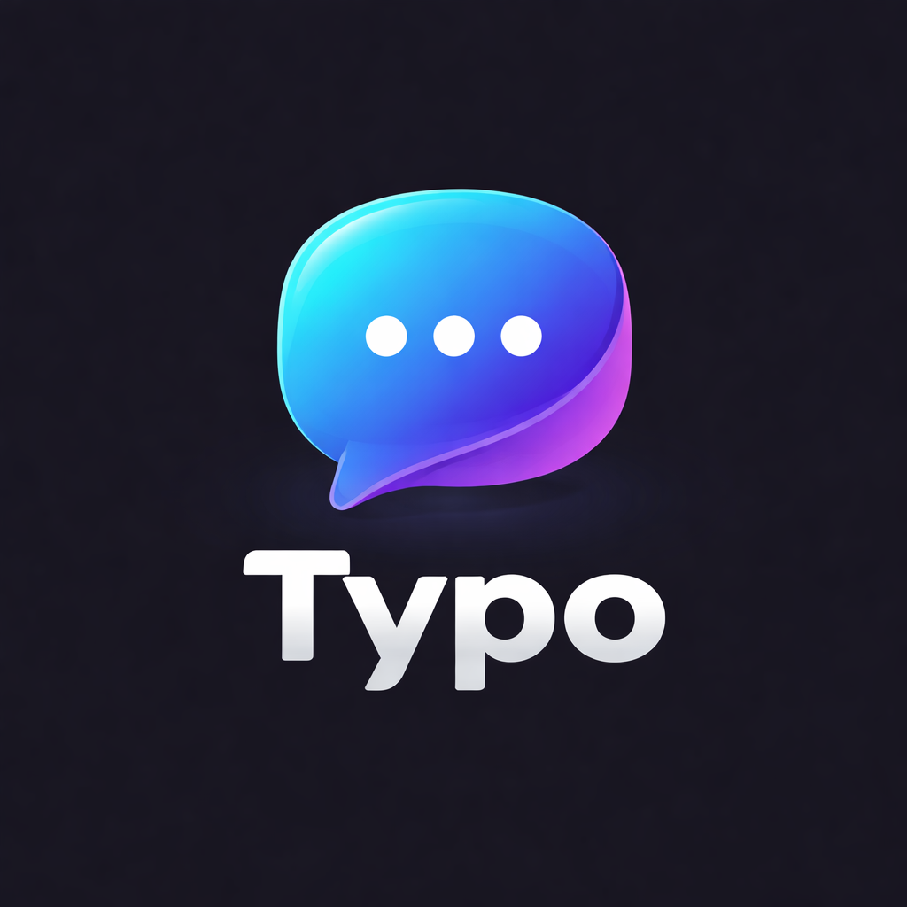

# Typo 💬✨

<div align="center">
  
  <h3>A Real-time Aesthetic Chat Experience</h3>
  <p>Modern, glassmorphic, and blazing fast.</p>
</div>

---

## 🌟 Overview
**Typo** is a next-generation real-time chat application built for individuals who value both functionality and aesthetics. Featuring a stunning glassmorphism design system, Typo provides a premium communication experience with seamless integration of real-time messaging, room sharing, and social connectivity.

## 🚀 Features

- **💎 Glassmorphism UI**: A premium, transparent, and vibrant interface designed to WOW at first glance.
- **⚡ Real-time Messaging**: Instant message delivery and status updates powered by Supabase Realtime.
- **👥 Friend Request System**: Connect with others using unique identifiers (e.g., `username#1234`).
- **🏠 Private & Public Rooms**: Create custom chat rooms and share them instantly with 6-character short codes.
- **🔔 Smart Notifications**: Real-time browser push notifications and audible pings for mentions and DMs.
- **🔐 Secure Authentication**: Robust user management and protection via Clerk.
- **🎨 Personalized Experience**: Customizable accent colors, layout density, and notification preferences.

## 🛠️ Tech Stack

- **Frontend**: [Next.js 14](https://nextjs.org/), [React](https://reactjs.org/), [Tailwind CSS](https://tailwindcss.com/)
- **Backend/Database**: [Supabase](https://supabase.com/) (PostgreSQL, Realtime, Storage)
- **Authentication**: [Clerk](https://clerk.com/)
- **State Management**: React Hooks & Context API
- **Icons**: [Lucide React](https://lucide.dev/)

## ⚙️ Getting Started

### Prerequisites
- Node.js 18+ 
- NPM / Yarn / PNPM
- A Supabase project and a Clerk application.

### Installation

1. **Clone the repository**:
   ```bash
   git clone https://github.com/NavDevs/Typo.git
   cd Typo
   ```

2. **Install dependencies**:
   ```bash
   npm install
   ```

3. **Environment Configuration**:
   Create a `.env.local` file in the root directory and add the following:
   ```env
   NEXT_PUBLIC_SUPABASE_URL=your_supabase_url
   NEXT_PUBLIC_SUPABASE_ANON_KEY=your_supabase_anon_key
   NEXT_PUBLIC_CLERK_PUBLISHABLE_KEY=your_clerk_publishable_key
   CLERK_SECRET_KEY=your_clerk_secret_key
   ```

4. **Database Setup**:
   Apply the migrations located in the `supabase/migrations/` directory to your Supabase project.

5. **Run the development server**:
   ```bash
   npm run dev
   ```

## 🧪 Testing the Application

1. **Room Sharing**: Large "Code: ABC123" badges in the room headers allow for instant sharing with friends.
2. **Real-time Sync**: Open two separate browser windows (or use incognito) to watch messages, room creation, and friend requests sync instantly without refreshing.
3. **Friend Requests**: Find your unique tag in the profile section and try adding yourself from another account!

---

<div align="center">
  Built with ❤️ by the Typo Team
</div>
